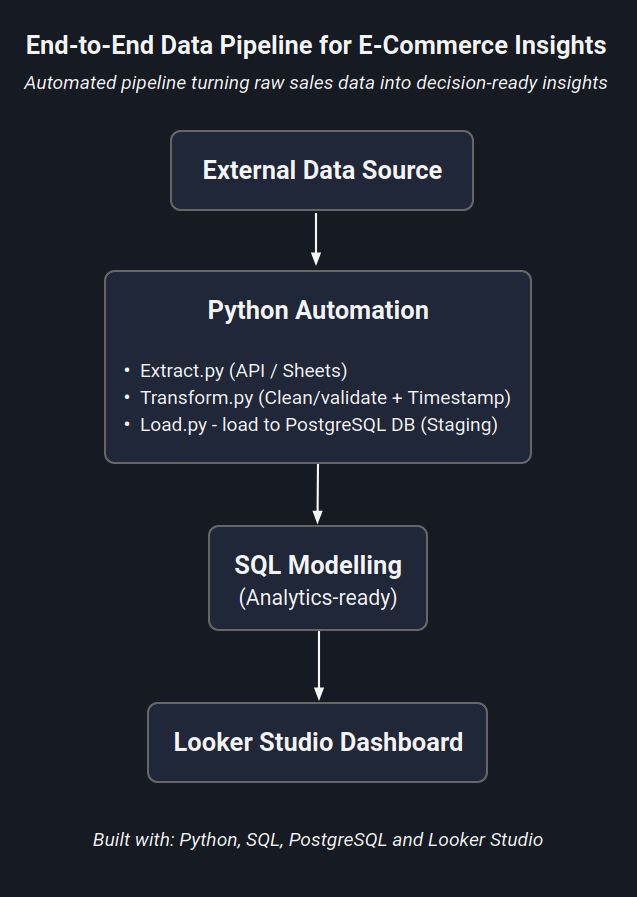
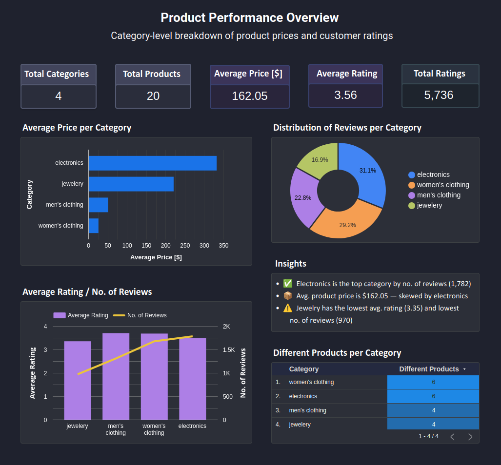
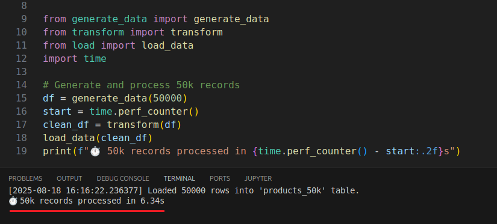
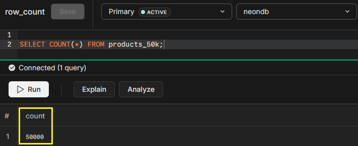

# 🛒 End-to-End Data Pipeline for E-Commerce Insights

📁 Project Type: Portfolio / Freelance Showcase

💼 Use Case: Shopify-style e-commerce product pipeline

🧩 Modules: API or CSV ingest → Transform → PostgreSQL → SQL Model → Dashboard

A complete, modular ETL pipeline built with Python, SQL, and PostgreSQL — designed to simulate a real-world e-commerce data workflow and deliver analytics-ready outputs for dashboards and decision-making. 

**Delivers a pipeline proven to drastically reduce manual data processing time.**

---

## 🚀 Overview

This project demonstrates a full-stack data engineering pipeline from raw data extraction to dashboard-ready insights.

**Designed to solve real-world e-commerce business needs** — ideal for freelance professionals, small businesses, and data teams seeking actionable insights. It mimics a Shopify-style data workflow with automated ingestion, data cleaning, transformation, and loading into a PostgreSQL database — followed by SQL modeling and a dashboard in Looker Studio.

⚡ **6.34 seconds** (50k rows) — ***99.97% faster** than manual processing*

---
High-level ETL flowchart — *see below for performance results*



---

## 🧱 Tech Stack


---

## 📊 Dashboard Output

Interactive dashboard created in **Looker Studio** from modelled PostgreSQL tables. Includes:

- 📈 Product KPIs
- 🛍️ Category breakdowns
- 📊 Performance insights



---

## 📁 Folder Structure

```bash
ecommerce-etl-dashboard-pipeline/
├── etl/
│   ├── extract.py                          # Extracts data from API or CSV
│   ├── transform.py                        # Cleans & validates data, adds timestamps
│   ├── load.py                             # Loads data into PostgreSQL (with retries)
│   └── __init__.py                         # Makes 'etl' a package
├── tests/                                  # Contains scripts for performance testing
│   ├── generate_data.py                    # Generates 50k lines of product data
│   ├── test_performance.py                 # Tests same pipeline but using 50k rows of data
│   └── __init__.py                         # Makes 'tests' a package
├── docs/
│   ├── images/
│   │   ├── etl_pipeline_flowchart.png      # High-level project flowchart
│   │   ├── product_insights_dashboard.png  # Image of Looker Studio dashboard
│   │   └── validation/
│   │       ├── performance_test.png        # Image of etl test result for 50k rows
│   │       ├── row_count.png               # Confirmation of all rows loaded to PostgreSQL
│   │       └── format_check.png            # Confirmation of format of loaded data
│   └── sql/
│       ├── products_dashboard_ready.sql    # SQL model for dashboard tables
│       └── validation_queries.sql          # SQL for confirming row count and format
├── .env.example                            # Example config file for DB credentials
├── .gitignore                              # Excludes .env and other sensitive files
├── README.md                               # Project overview (this file)
└── requirements.txt                        # List of dependencies used by the scripts

```
---

## 🛠️ Setup Instructions

1. **Clone the repository**

```bash
git clone https://github.com/DataOfAus/ecommerce-etl-dashboard-pipeline.git
cd ecommerce-etl-dashboard-pipeline
```

2. **Create a `.env` file**

Use the provided template:

```bash
cp .env.example .env
```

Update the `.env` file with your PostgreSQL credentials:
(If you’re unsure of your database credentials, ask your developer or hosting provider)

```
CLOUD_DB_USER=your_username
CLOUD_DB_PASSWORD=your_password
CLOUD_DB_HOST=your_host
CLOUD_DB_PORT=5432
CLOUD_DB_NAME=your_database
```

3. **Install dependencies**

It's recommended to use a virtual environment:

```bash
pip install -r requirements.txt
```

4. **Run the full ETL pipeline**

The `load.py` script automatically calls the extract and transform scripts:

```bash
python load.py
```

This will:
- Extract data (via `extract.py`)
- Transform it (via `transform.py`)
- Load it into PostgreSQL (`load.py`)

5. **Run SQL model to create dashboard table**

Connect to your PostgreSQL database and run the SQL script:

```sql
-- In your SQL client
\i docs/sql/products_dashboard_ready.sql
```

6. **Connect to Looker Studio (optional)**

- Connect Looker Studio to your PostgreSQL database.
- Use the modelled table (`products_dashboard_ready`) to build charts.

---

## ⏱️  Performance Testing  
*Validating pipeline efficiency at scale*

This project includes tools to test ETL performance with large datasets:
- **`generate_data.py`**: Creates mock Shopify-style product data (50k records)
- **`performance_test.py`**: Times full ETL execution from generation → Neon PostgreSQL load
- **SQL validation scripts**: Verify record counts and data format

### 🔍 Benchmark Results (50k Records)  
| **Process**               | **Time**  | **Key Optimization**   |
|---------------------------|-----------|------------------------|
| Data Generation           | 0.8s      | Vectorized Pandas      |
| Transformation            | 1.2s      | Parallelized ops       |
| Cloud Load (Neon)         | 4.3s      | SQLAlchemy bulk insert |
| **Total**                 | **6.34s** | **End-to-end**         |

*Compared to a manual workflow*

| End-to-End ETL    | Time              |
|-------------------|-------------------|
| Manually          | ~ 6 hours         | 
| Automated         | **6.34 seconds**  | 

*(Time will scale linearly with larger datasets, depending on API or CSV latency)*

**Performance test yielding the 6.34s total runtime result for 50k records**



**PostgreSQL query confirming all 50k records loaded**



*Tested on 4 vCPU, 12 GB RAM (Ubuntu 24.04 LTS VM) with PostgreSQL 16 (Neon.tech)*

---

### 🔄 How to Reproduce  
1. Run the performance test:
```bash
   python tests/test_performance.py
```

---

## 📞 Let’s Build Your Data Solution 

**I help e-commerce teams:** 

✅ Replace 6-hour manual reports → **6-second pipelines**  
✅ Turn API chaos → **auto-refreshing dashboards**  
✅ Guarantee **zero data loss** with industrial validation  

**Why choose me?** 

- 🛠️ Professional Engineer – pipelines built for scale  
- 📊 Full-stack ownership – API to Looker Studio  
- 📈 Proven efficiency – 7,887 rows processed per second in benchmarks
- 🔍 Full transparency – review the code yourself

Get started:

📧 Email: data.of.aus@outlook.com

🔗 LinkedIn: [LinkedIn](https://www.linkedin.com/in/aaron-mietzel/)

---
